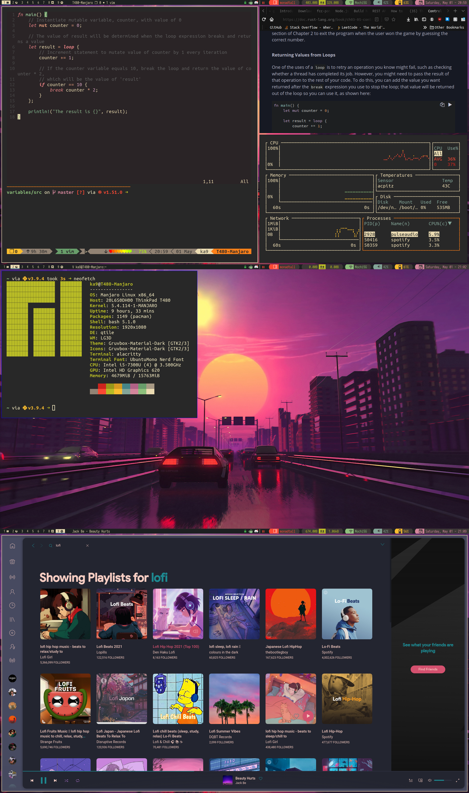

### Built With

* wm: [qtile](http://www.qtile.org/)
	* adapted from [distrotube](https://gitlab.com/dwt1/dotfiles/-/blob/master/.config/qtile/config.py)
* status-bar: built-in qtile panel
* terminal: [alacritty](https://github.com/alacritty/alacritty)
* terminal multiplexer: [tmux](https://github.com/tmux/tmux)
* editor: [vim](https://www.vim.org/)
	* [miramare](https://github.com/franbach/miramare)
* app-launcher: [rofi](https://github.com/davatorium/rofi)
	* [custom rofi addons](https://github.com/adi1090x/rofi)
* file-manager: [thunar](https://wiki.archlinux.org/index.php/thunar)
* terminal font: Ubuntu Mono
* firefox: [SimplerentFox](https://github.com/MiguelRAvila/SimplerentFox)
* spotify-theme: [Dribbblish](https://github.com/morpheusthewhite/spicetify-themes/tree/master/Dribbblish)
* notifications: [dunst](https://github.com/dunst-project/dunst)
* music player: [cmus](https://github.com/cmus/cmus)
